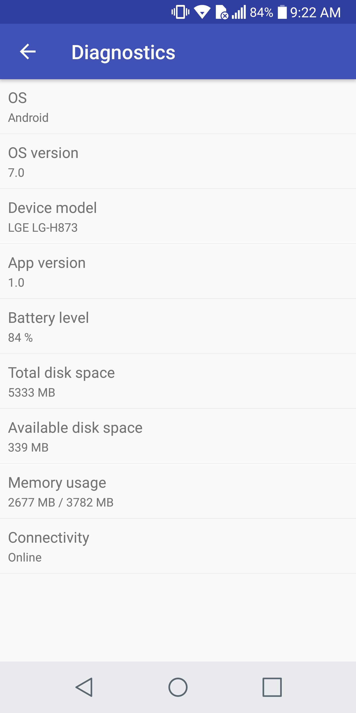

# GoDiagnostics

A library that offers you an easy way to add a diagnostics activity to your Android project.

## How-to use

Add the dependency to your project's `build.gradle`:

```
repositories {
    jcenter()
    maven {
        url 'https://mirego.bintray.com/public'
    }
}
...
dependencies {
	compile 'com.mirego.public:GoDiagnostics:<RELEASE_VERSION>'
}
```

Use the following snippet to show the diagnostics Activity
```
startActivity(new Intent(<CONTEXT>, DiagnosticsActivity.class));
```

## Screenshot



## License

`GoDiagnostics` is © 2017 [Mirego](http://www.mirego.com) and may be freely distributed under the [New BSD license](http://opensource.org/licenses/BSD-3-Clause).  See the [`LICENSE.md`](https://github.com/mirego/gogradle/blob/master/LICENSE.md) file.

## About Mirego

[Mirego](http://mirego.com) is a team of passionate people who believe that work is a place where you can innovate and have fun. We’re a team of [talented people](http://life.mirego.com) who imagine and build beautiful Web and mobile applications. We come together to share ideas and [change the world](http://mirego.org).

We also [love open-source software](http://open.mirego.com) and we try to give back to the community as much as we can.
